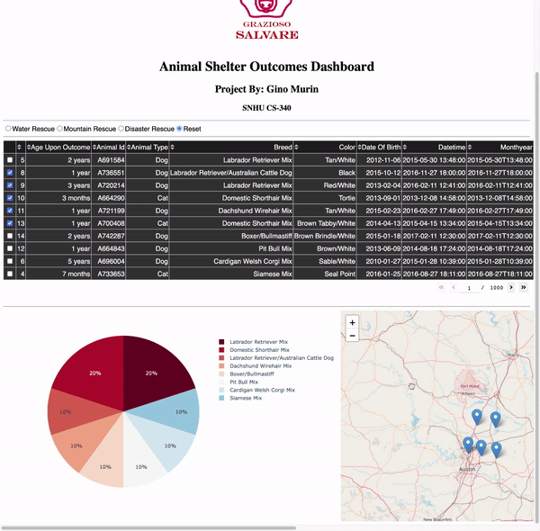

# Animal-Rescue-App



## About the Project/Project Title
This CRUD Python module, developed as part of our module four coursework serves as a means of connecting to our database within the application that we will be building. The module utilizes the PyMongo library, which allows for easy interface between MongoDB and our chosen back-end language of Python. The module will facilitate create and read operations initially followed by update and delete operations as we continue to build out our application. 


## Motivation
The purpose of this project is to create a clean, concise module to handle CRUD operations using Python. The modular nature of this project will allow for easy adaptation to a variety of different use cases beyond this course.

## Getting Started 

To get a local project up and running follow these steps:

1. Create a local MongoDB server by using the following command (make note of the port number): 
```/usr/local/bin/mongod_ctl mongo start```

2.	Login to your administrative account using the command:
mongo –authenticationDatabase “admin” -u “<your_username>” -p
3.	Create a database, if necessary, exit mongo shell, and navigate to the project dataset’s directory. Import using the following command:
monogimport --db AAC --collection animals --type=csv --headerline --port <YOUR PORT NUMBER> --file= ./aac_shelter_outcomes.csv

